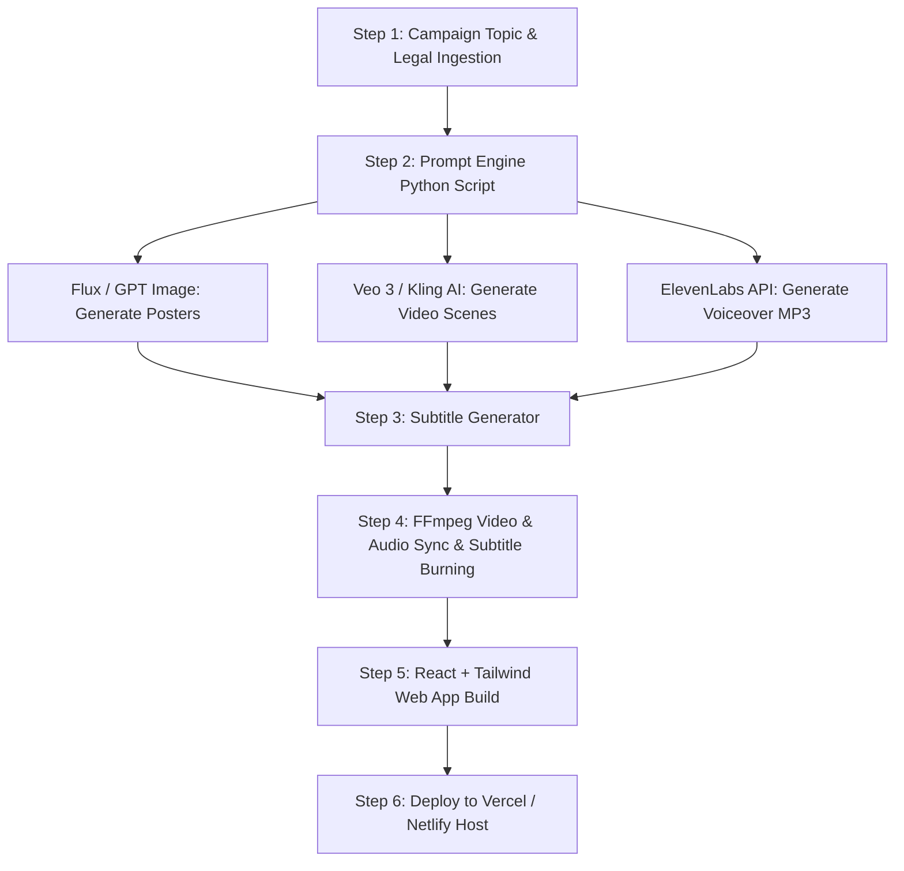

# 07. End-to-End Automation Pipeline Documentation

## 1. Pipeline Architecture Diagram



---

## 2. Step-by-Step Execution Guide

### Prerequisites
* Python 3.10+
* Node.js v18+ & npm
* FFmpeg installed in system PATH

### Commands

1. **Execute Master Python Automation Script:**
   ```bash
   cd pipeline
   python generate_campaign.py
   ```

2. **Generate Subtitles Standalone:**
   ```bash
   python generate_subtitles.py
   ```

3. **FFmpeg Video Stitching Command:**
   ```bash
   ffmpeg -y -f concat -safe 0 -i file_list.txt -i voiceover.mp3 -vf "subtitles=subtitles.srt" -c:v libx264 -crf 18 -c:a aac output_campaign.mp4
   ```

4. **Build & Deploy Web Application:**
   ```bash
   cd website
   npm run build
   python ../pipeline/deploy_site.py
   ```
